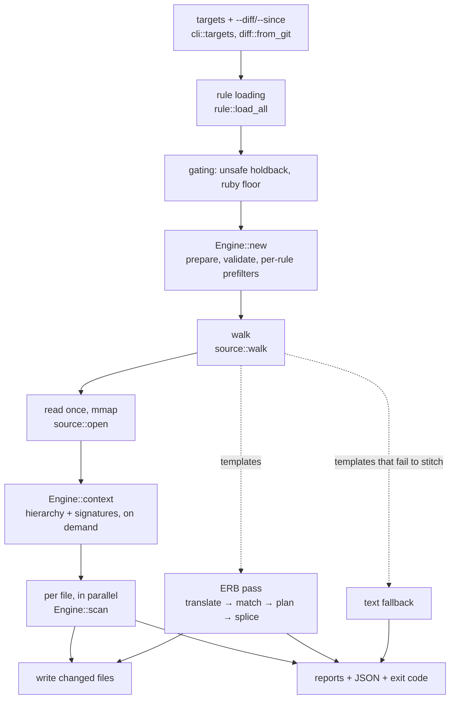

# rwr — architecture

How the pieces fit, what flows through them, and what you must understand before
adding a feature. Companion to [DESIGN.md](../../DESIGN.md) (what rwr is and
why), [decisions.md](decisions.md) (why each piece is shaped as it is —
referenced here as D-numbers), and [cli-conventions.md](cli-conventions.md) (the
public output contract). This describes the *system*: read it before reading the
source, not instead of it.

## 1. The model

rwr is a batch compiler run in reverse: instead of compiling one program with
many rules, it compiles a handful of rules once and streams a repository through
them. A run has no state before it and none after it (D5) — every question is
answered by walking, reading, and parsing, made affordable by refusing to parse
almost everything (the literal prefilter).

The core abstraction is the **total account**: every file, match, and identifier
occurrence a run touched must end the run labelled — rewritten, found, refused,
skipped, suppressed, deferred, or residue — and the label must reach the output.
Most of the code that is not matching or splicing exists to keep that accounting
honest, and nearly every bug this project has shipped was a leak in it: work that
silently fell out of the pipeline while the run reported clean.

## 2. The pipeline, end to end

`check` and `rewrite` are one code path (`cli::cmd_apply`) differing only in
whether bytes reach disk and how the exit code reads (D29, D22). `find` is a
simpler sibling; `test` feeds fixtures through the same evaluator instead of
files.

1. **Scoping** (`cli::targets`, `src/diff.rs`). Paths, `file.rb:N-M` suffixes and
   `--diff`/`--since` resolve into a walk list plus an optional `diff::Changed`.
   A path that does not exist is an error, never an empty walk — a vacuous green
   gate is the failure this refuses.
2. **Rule loading** (`src/rule.rs`). `load_all` resolves four ways: an inline
   `-r` template, a YAML file, a directory pack, or a name in the compiled-in
   pack. The `method:`/`rename:` shorthand expands to three rules before anything
   else sees it. The schema is `deny_unknown_fields` throughout — a typo'd key is
   a diagnostic, not a rule silently missing its constraint.
3. **Gating** (`cmd_apply`). `unsafe:` and `ruby:` holdbacks, both *counted on
   stderr unconditionally*: a rule that did not run must never look like a rule
   that found nothing.
4. **`Engine::new`** (`src/engine.rs`). Everything checkable before a file is
   read. Also decides two run-wide facts: `claims_completeness` (does any rule
   move a *definition*? only then does residue apply) and `unnarrowed` (no rule
   has a `type:`, so matched receivers are tallied for the cross-class warning).
5. **Walk** (`src/source/mod.rs`). Parallel, gitignore-aware, vendored paths
   excluded by whole path component. Produces Ruby files and template files in
   one pass; templates are carried forward rather than dropped.
6. **Read** (`source::open`). Each candidate mapped once, the bytes shared by
   every later phase. That sharing — not the mapping — is the biggest measured
   win in the project (see [scaling.md](scaling.md); I/O, not parsing, dominates
   every profile).
7. **`Engine::context`**. Class hierarchy and Sorbet return types, each built
   only if some rule asks, each per run, never cached.
8. **`Engine::scan`**, per file in parallel — the heart. Prefilter, then a
   *generation loop*: parse once, run each remaining rule against that parse, and
   the first rule producing edits ends the generation and reparses. Rules that
   match nothing share one parse. Inside: suppression filtering (so `check` and
   `rewrite` cannot disagree), `--diff` line scoping, findings from rules with no
   `rewrite:`. After: stale-directive detection, then residue **against the final
   rewritten bytes**. Yields `ScanOutcome`: `Unparseable`, `Quiet`,
   `Refused(reason)` (per file — one bad file does not abort the good ones), or
   `Scanned` with the full account.
9. **Write**. `rewrite` writes `Scanned.rewritten`; `check` does not. That is the
   entire difference.

**Where ERB diverges and rejoins.** Tag bodies are stitched into one Ruby program
(`erb::translate` — necessary because many tags do not parse alone), matched with
the *same* criteria via `Engine::criteria(index, ctx)`, and edits mapped back and
applied by `erb::splice`, which refuses any edit spanning two tags. Templates
that fail to stitch fall to a text-only search, labelled as weaker evidence. It
is a *different data flow*, not another `scan` caller — which is why
`Engine::prepared()` and `Engine::criteria()` exist as seams.

**What is skipped when.** `find` skips rule loading, gating, context and
templates. `test` skips walking entirely — each fixture snippet is the whole
corpus, including for `Engine::context`. Residue is skipped when
`claims_completeness` is false. Hierarchy and signatures are skipped unless asked
for.

## 3. The seams that matter

**`Engine::{new, context, scan}` — one evaluator, ever.** The invariant: *a
fixture must exercise the code that ships*. A second, simpler evaluator would
pass tests against behaviour that differs from production — the drift fixtures
exist to catch, arriving through the back door. If you are looping over
`matcher::search` yourself, you are building the second evaluator; use `scan`, or
if your data flow genuinely differs (the ERB pass), take `Engine::prepared()` +
`Engine::criteria()` so match semantics still come from one place.

**`effective_range` is the only splice-able range (D14).** A heredoc body sits
far past its node's own `location()`, and detaching one *still parses* — no
downstream check catches it. `captured_text` splices through `effective_range`
exclusively and refuses a discontiguous capture. `verify` (reparse after apply)
backstops the invalid-output half only; it cannot catch a wrong-but-valid splice,
which is why the range discipline exists rather than relying on it.

**The prefilter is conservative by construction.** A file is skipped only when it
*provably* cannot contribute. The subtle half: a **match** needs every required
literal, but **residue** needs only the anchor, and residue lives in files the
rule does not match. `may_contribute` checks the two disjunctively. Collapse them
and you silently drop the blind-spot report the product exists to produce.
(`residue::tests::an_anchor_is_always_one_of_the_required_literals` pins why the
engine can pass no anchors today, and names the fix for the day that changes.)

**Criteria are applied inside the search (Q13).** A node can admit several
bindings and only a later one may satisfy `where:`. A `Verdict::BadBinding`
forbids that binding and retries; `WrongScope` and `Bug` break instead. A new
predicate must decide which kind it is — the answer determines whether rejection
retries or gives up.

**Residue is computed against the rewritten source.** Not before: occurrences the
rules already converted must not be double-reported, and — the sharper half — a
subclass call site a rename *failed* to reach is only visible in the output text.
It is computed even when nothing changed; an earlier `total == 0` early-return
skipped exactly the dangerous file, measured on the testbed as recall 4/7 → 7/7.

**The ERB coordinate boundary** (`erb::to_template`). Every offset computed
against stitched Ruby maps back through one function, which returns `None` for a
range crossing a fragment — those bytes are HTML. `splice` refuses rather than
guessing.

**The output contract** ([cli-conventions.md](cli-conventions.md)). Exit codes
are pinned by a unit test; `Retryable` is never collapsed into `Refused`. Field
names are stable across commands. Bump `REPORT_SCHEMA` when the shape changes.

## 4. Where state lives, and where it deliberately does not

Nothing persists (D5): no index, no cache, no daemon. Parse, answer, exit. That
buys the absence of an entire bug class — invalidation, staleness, coherence —
and costs rebuilding per run: the class hierarchy (only when a rule says
`subclasses:`, and only the part reachable from the classes the rules name), the
signature index (only when a rule says `type:`), and walk/read/parse always.

Two things that look like state and are not: the mmap of each file is a per-run
view shared across phases, and the built-in pack is compiled into the binary
(D54) — it is code, not state.

One asymmetry worth knowing: `find` reads with `std::fs::read` while `check`
maps. Measured, not accidental — mmap wins only when several phases reuse the
bytes ([scaling.md](scaling.md)).

## 5. Invariants a change must not break

**Enforced by structure** — you would have to work to violate these:

- Splicing goes through `effective_range`; the capture API exposes no raw
  location (D14).
- Rewritten output reparses or the whole transformation is discarded (`verify`).
- Overlapping edits abort; contained matches are dropped *and counted* → exit 4.
- Unknown rule keys are load errors; constraints naming uncaptured metavariables
  fail in `Rule::validate` before any file is read.
- The bare-pattern shorthand can only desugar to `find`/`check` (D30).
- A fixture that asserts nothing is refused at load; a fixture-less pack is an
  error, not a pass.
- Exit-code numbers are pinned by a unit test.

**Enforced only by convention** — the bug source. Each has already produced a
real, *silent* bug:

- **Parallel positional vectors.** `Engine` holds `rules`, `prepareds`,
  `contained`, `filters` aligned by index. The ERB pass once indexed the
  sub-pattern map at `[0]` instead of by rule — clean run, wrong constraints.
  `Engine::criteria(index, ctx)` assembles criteria in one place precisely so a
  caller cannot re-assemble them differently. Be suspicious of any new `.zip()`
  over these vectors outside the engine.
- **The total account.** Every new way work can be declined must be counted into
  the report by hand. Nothing structural forces it; forgetting produces exit 0
  with less work done. See §6.
- **Two output planes.** Human text and `-j`/`-J` are separate render paths over
  the same data. `templates_skipped` diverged between them and the machine plane
  over-claimed a blind spot for a full release.
- **Coordinate discipline.** Byte offsets are meaningful only against the buffer
  that produced them. `scan` replaces `current` each generation; the suppression
  `used` set keys on document order because line numbers do not survive rewrites;
  ERB offsets are Ruby-side until mapped. Nothing type-distinguishes them.
- **Scope units.** A suppression directive scoped to the widest *node* on its
  line swallowed a whole file, because above the first statement the widest node
  is the program itself (comments are not in the tree). When attaching anything
  to "the thing on this line", the tree offers several wrong answers that work in
  every test not sitting at a boundary.
- **Flag grammar.** `--diff [REV]` with an optional value consumed a following
  path as its revision. The convention now: no optional-value flags.

## 6. The failure class this codebase produces

Nearly every recent bug reads the same way: **a run that completes clean while
having done the wrong amount of work.** Not crashes, not corrupt output — exit 0,
plausible report, silently missing or misdirected work.

Three structural reasons, worth internalising rather than treating each instance
as bad luck:

1. **rwr is a cascade of filters over an enormous input.** Walk exclusions,
   extension lists, the prefilter, parse-error skips, diff scoping, suppression,
   constraints, gating, the template fallback, splice refusals — a dozen stages
   whose job is to make work disappear. A filter that over-fires is
   *indistinguishable from a quiet corpus* at every later stage. No downstream
   consistency check is possible, because "nothing matched" is a legitimate and
   common answer.
2. **Several features are conservative on purpose.** Type narrowing declines
   unresolved receivers; the prefilter may keep useless files but must never skip
   contributing ones. "Did less than it might have" is *correct* for these — so
   no assertion can flag doing less, and a bug that does less hides inside the
   design's own slack.
3. **Correctness is spread across parallel structures updated by convention**
   (§5) — index-aligned vectors, twin output planes, offset spaces. Each is cheap
   to get wrong in a way that type-checks.

What that means for a feature author:

- **For every new way work can vanish, add the counter in the same change.** If
  your feature can decline work and you cannot point at the line that reports the
  declining, you have written the next bug in this family.
- **Test the boundary of the gate, not its middle.** The directive bug lived only
  above a file's first statement; the exclusion bug only under a path containing
  `tmp`. Write the fixture just inside the edge, just outside it, and where the
  filter should *not* fire.
- **Assert amounts, not just outcomes.** `finds:`, `sites`, residue counts. A
  test asserting "exit 0" cannot catch this class by definition — exit 0 is the
  symptom.
- **Check both output planes and the exit code** whenever the report changes.
- **Run the identity-rewrite property** when touching `rewrite/`.

## 7. Extension points

**A new `where:` predicate.** Field on `Constraint` (`src/rule.rs` — the schema
*is* the struct); pre-validation in `Rule::validate` if it can be statically
wrong; a `ConstraintMiss` variant and an arm in `matcher::verdict`; extend
`Verdict::constraint()` and `Verdict::detail()`. Decide the Q13 question
explicitly. In step: fixtures, the skill, the changelog.

**A new verb.** A `Command` variant and a `cmd_*` in `src/cli/mod.rs`. Decide its
exit-code polarity (D22) and document it. It must honor `-j`/`-J` with stable
field names, and land with an e2e assertion in the same change. If it evaluates
rules against source it consumes `Engine` — a new verb is never a new evaluator.

**A new output format** (SARIF is the recorded candidate). Extend `Output` and
the `emit_*` seam; the data is already in `Report`. The trap is partial coverage:
every command that prints must honor it, or the format is a lie in half the tool.

**A new suppression source.** `Suppressed.source` and `Stale.source` already
discriminate. Carry over the staleness symmetry: *a suppression whose finding is
gone is itself a finding*, reported unconditionally. Suppression filters findings
and edits, never residue (D72).

**A new file kind.** If it *is* Ruby under another name: `RUBY_EXTENSIONS` /
`RUBY_FILENAMES`. If it *embeds* Ruby (Haml, Slim): it needs what ERB has — a
`translate` producing stitched Ruby with a fragment map, and a `splice` that
refuses cross-fragment edits — plus wiring into the template pass and removal
from the text-fallback set. Until then it stays in `TEMPLATE_EXTENSIONS`, counted
and text-searched, which is the honest degradation (Q11).

**A new sequence transform.** `rewrite::sequence::Transform` is a closed set by
design (D33) — an unknown name is a refusal, never literal output.

**A new resolvable receiver shape.** `matcher::resolve_type` is the single
resolution function; extend it only in the conservative direction (`None` means
"not known", never "assume yes"), and record the measurement that justifies the
new arm the way D61 did.

## 8. Map of the crate

| Path | Responsibility |
|---|---|
| `src/main.rs`, `src/cli/mod.rs` | Arg parsing, verbs, gating, orchestration, reporting, exit codes. The public contract. |
| `src/engine.rs` | The one evaluator: `Engine::{new, context, scan}`, `ScanOutcome`/`Scanned`. |
| `src/rule.rs` | Rule schema, validation, packs, `method:` expansion, fixtures. |
| `src/pattern/metavar.rs` | Lexical metavariable scanner (D32). |
| `src/pattern/prepare.rs` | Placeholder substitution + case repair (D18). |
| `src/pattern/prefilter.rs` | Required-literal extraction, the skip gate. |
| `src/pattern/matcher.rs` | Structural match, bindings, rebind loop, verdicts, receiver resolution. |
| `src/pattern/compare.rs`, `generated.rs` | AST equality; schema-generated accessors. |
| `src/rewrite/mod.rs` | `effective_range`, structural diff, template render, plan/apply/verify. |
| `src/rewrite/sequence.rs` | Sequence transforms, deletion units, comment attachment. |
| `src/residue/mod.rs` | Anchors, occurrence finding and classification, class scoping, comments. |
| `src/source/mod.rs` | Walk, file-kind lists, mmap, line/col, identifier search. |
| `src/erb.rs` | Tag stitching and the Ruby↔template coordinate map. |
| `src/hierarchy/`, `src/sigs.rs` | Per-run subclass links; Sorbet return types. |
| `src/suppress.rs` | `# rwr:ignore`: attachment, statement scoping, staleness. |
| `src/diff.rs` | git-derived and hand-named changed-line scoping. |
| `src/ruby.rs`, `src/profile.rs` | Ruby-version detection; the `--profile` table. |
| `tests/cli_e2e.rs` | The built binary against temp repos — where output and exit claims are pinned. |
